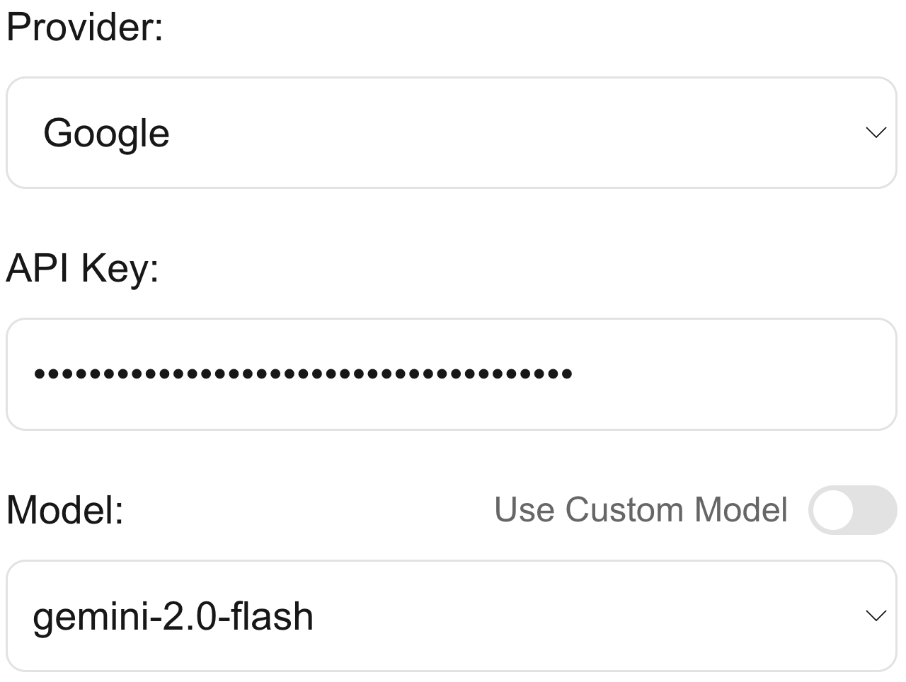

# react-model-picker



A simple component and hook that works with the Vercel AI SDK to allow the user to switch between different providers, models, and API keys quickly and easily.

### Features

- ▲ Vercel AI SDK Compatibility
- 📦 Works out of the Box
- 🧩 Built in TypeScript to ensure Type Safety
- 💾 [`localStorage` support to save settings](#general-options)

## Quick Start

This is all you need to make a model switcher with OpenAI and Google Generative AI providers, just like the image above.

```jsx
"use client";

import { useState } from "react";
import { generateText } from "ai";
import { createOpenAI } from "@ai-sdk/openai";
import { createGoogleGenerativeAI } from "@ai-sdk/google";
import { ModelPicker } from "@/packages/react-model-picker";

export default function MyComponent() {
	const [model, setModel] = useState(null);

	return (
		<>
			<ModelPicker
				providers={[
					{
						name: "OpenAI",
						models: ["gpt-4o", "o4-mini"],
						provider: createOpenAI,
					},
					{
						name: "Google",
						models: ["gemini-2.0-flash", "gemini-2.5-pro"],
						provider: createGoogleGenerativeAI,
					},
				]}
				onModelChange={setModel}
			/>

			<button
				onClick={async () => {
					if (model) {
						console.log(
							await generateText({
								model: model,
								prompt: "What model are you",
							})
						);
					}
				}}
			>
				Generate
			</button>
		</>
	);
}
```

You can switch out the Vercel AI SDK compatible providers in the object simply by importing a new provider. You can also provide some models to choose from, although the user can also input their own model.

It's as simple as that—now you can use the `model` as normal.

View a few other advanced options [here](#modelpicker-component) or use the [`useModelPicker` hook for full customizability](#usemodelpicker-hook).

## API Documentation

### Provider Format

The provider list is always an array. Each provider looks like this:

```js
{
    name: "OpenAI", // Display name for the provider
    models: ["o3-mini", "o4-mini"], // Default models to use
    provider: createOpenAI // The Vercel AI SDK provider
}
```

See the [Quick Start](#quick-start) for an example of importing the models and everything all together.

### General Options

Options are always passed in as an object in `ModelPicker` (`options` prop) and `useModelPicker` (second argument after `providers`).

There are two options currently:

#### `useLocalStorage` Option

Boolean. Set to `true` to save preferred provider, model, and API Key in `localStorage` to presist between sessions.

This uses [useHooks' `useLocalStorage`](https://usehooks.com/uselocalstorage) under the hood. If you're on something like Next.js, ensure you are in a Client Component, ideally with the [useHook `useIsClient`](https://usehooks.com/useisclient) hook.

#### `modelType` Option

Use the `ModelType` enum imported from `react-model-picker`.

There are 3 options currently:

- `ModelType.Language`: Use for language models. Default.
- `ModelType.Embedding`: Use for embedding models
- `ModelType.Image`: Use for image generation models.

Under the hood, they simply call `.languageModel()`, `.textEmbeddingModel()`, and `.imageModel()` respectively on the Vercel AI SDK provider.

Note that `useModelPicker` can take a type parameter for what type of model you're using. For example, you may write `useModelPicker<LanguageModel>(/* ... */)`. The options are `LanguageModel`, `EmbeddingModel<string>`, and `ImageModel`. It defaults to `LanguageModel`.

#### Example Configuration

Here's what a potential configuration with `ModelPicker` could look like:

```jsx
<ModelPicker
	providers={
		[
			// ... providers
		]
	}
	options={{
		useLocalStorage: true,
		modelType: ModelType.Language,
	}}
	onModelChange={setModel}
/>
```

Here's that same configuration for `useModelPicker`:

```tsx
useModelPicker<LanguageModel>(
	[
		// ... providers
	],
	{
		useLocalStorage: true,
		modelType: ModelType.Language,
	}
);
```

### `ModelPicker` Component

The `ModelPicker` hook takes the following props:

| Prop Name       | Description                                                                      |
| --------------- | -------------------------------------------------------------------------------- |
| `providers`     | Which providers are available to pick from. Learn more [above](#provider-format) |
| `options`       | Options you can pass in. Uses the [general options format](#general-options).    |
| `onModelChange` | Called when the `model` changes. Use it to update which model is used.           |

### `useModelPicker` Hook

The `useModelPicker` hook returns a set of functions to help you manage state. The actual function itself takes two parameters: `providers` (Learn more [above](#provider-format)) as well as `options` (Learn more [above](#general-options)).

It also takes a type parameter for what type of model you are using (The options are `LanguageModel`, `EmbeddingModel<string>`, and `ImageModel`.)

Here's what it could look like:

```tsx
const {
	providerList,
	selectedProvider,
	setSelectedProvider,
	apiKey,
	setApiKey,
	modelIdList,
	modelId,
	setModelId,
	model,
} = useModelPicker<LanguageModel>(
	[
		// ... providers
	],
	{
		// ... options
	}
);
```

Here's what each of the values returned do:

| Value Name            | Description                                                             |
| --------------------- | ----------------------------------------------------------------------- |
| `providerList`        | The original provider list you passed in.                               |
| `selectedProvider`    | Current selected provider, string referencing `name` of provider.       |
| `setSelectedProvider` | Change selected provider.                                               |
| `apiKey`              | Current API key entered as string.                                      |
| `setApiKey`           | Change current API key.                                                 |
| `modelIdList`         | List of model IDs available for the current model (what you passed in). |
| `modelId`             | Current model ID selected.                                              |
| `setModelId`          | Change current model ID selected.                                       |
| `model`               | The Vercel AI SDK model object.                                         |

A few notes on `useModelPicker`:

- `setModelId` can set the ID to something _not in the modelIdList_. You can use this to load custom models.
- `apiKey` and `modleId` automatically are being saved for each provider. They'll be automatically updated as you change providers.

This could be a custom implementation with `useModelPicker`:

```tsx
"use client";

import { generateText, LanguageModel } from "ai";
import { createOpenAI } from "@ai-sdk/openai";
import { createCerebras } from "@ai-sdk/cerebras";
import { createGoogleGenerativeAI } from "@ai-sdk/google";

import { useModelPicker } from "@/packages/react-model-picker";

export default function Home() {
	const {
		providerList,
		selectedProvider,
		setSelectedProvider,
		apiKey,
		setApiKey,
		modelIdList,
		modelId,
		setModelId,
		model,
	} = useModelPicker<LanguageModel>([
		{
			name: "OpenAI",
			models: ["o3-mini", "o4-mini"],
			provider: createOpenAI,
		},
		{
			name: "Cerebras",
			models: ["llama-4-scout-17b-16e-instruct", "llama-3.3-70b"],
			provider: createCerebras,
		},
		{
			name: "Google",
			models: ["gemini-2.0-flash", "gemini-2.0-flash-thinking"],
			provider: createGoogleGenerativeAI,
		},
	]);

	return (
		<div className="max-w-md mx-auto mt-10 p-6 bg-white rounded-lg shadow-md">
			<div className="mb-4">
				<label className="block text-sm font-medium text-gray-700 mb-1">
					Provider
				</label>
				<select
					value={selectedProvider}
					onChange={(e) => setSelectedProvider(e.target.value)}
					className="w-full px-3 py-2 border border-gray-300 rounded-md shadow-sm focus:outline-none focus:ring-blue-500 focus:border-blue-500"
				>
					{providerList.map((provider) => (
						<option key={provider.name} value={provider.name}>
							{provider.name}
						</option>
					))}
				</select>
			</div>

			<div className="mb-4">
				<label className="block text-sm font-medium text-gray-700 mb-1">
					API Key
				</label>
				<input
					value={apiKey}
					onChange={(e) => setApiKey(e.target.value)}
					className="w-full px-3 py-2 border border-gray-300 rounded-md shadow-sm focus:outline-none focus:ring-blue-500 focus:border-blue-500"
					type="password"
					placeholder="Enter API key"
				/>
			</div>

			<div className="mb-4">
				<label className="block text-sm font-medium text-gray-700 mb-1">
					Model
				</label>
				<select
					value={modelId}
					onChange={(e) => setModelId(e.target.value)}
					className="w-full px-3 py-2 border border-gray-300 rounded-md shadow-sm focus:outline-none focus:ring-blue-500 focus:border-blue-500"
				>
					{modelIdList.map((model) => (
						<option key={model} value={model}>
							{model}
						</option>
					))}
				</select>
			</div>

			<button
				onClick={async () => {
					console.log(
						await generateText({
							model: model,
							prompt: "What model are you",
						})
					);
				}}
				className="w-full bg-blue-600 hover:bg-blue-700 text-white font-medium py-2 px-4 rounded-md focus:outline-none focus:ring-2 focus:ring-blue-500 focus:ring-offset-2 transition duration-150 ease-in-out"
			>
				Generate
			</button>
		</div>
	);
}
```
